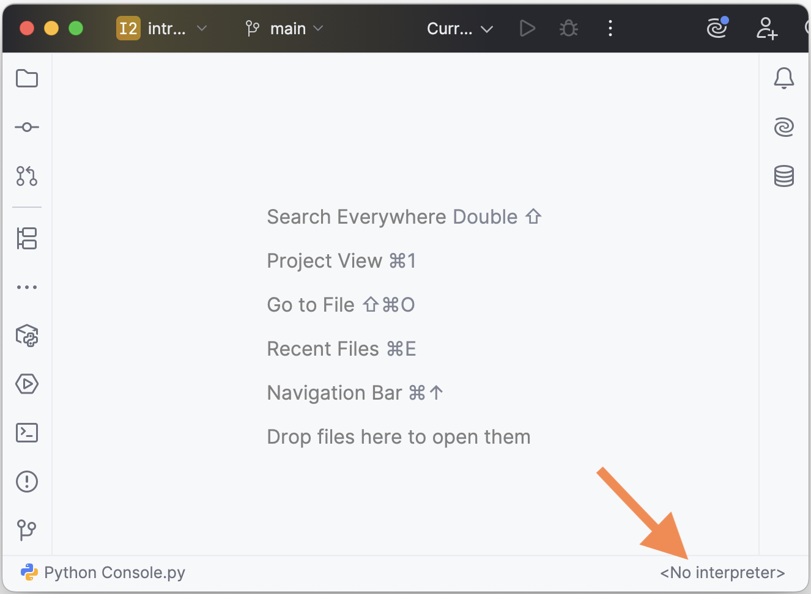
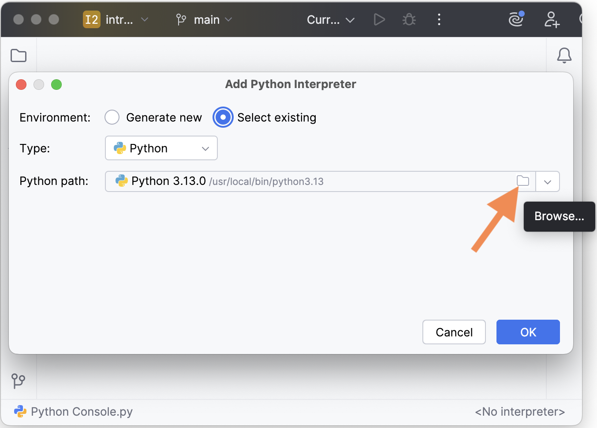

# Configuring Python in your code editor

## PyCharm
 
### 1. Open the Python Interpreter menu

   
   
### 2a. Select an existing interpreter

   
   
   If your desired version is listed, select it and you're done. If not, go on to 2b.

### 2b. OR add a new local interpreter

   

### 3. Select an existing interpreter
   
   
### 4a. Choose a version from the dropdown

   
   
   
   If your desired version was found, select it and press OK. If not, go on to 4b.

### 4b. Or manually look for your system interpreter

   
   

If you’re not sure where to find it, look in [these locations](PYTHON-LOCATIONS.md).
   

You should now see the desired version.

## Visual Studio Code

First, make sure you have a Python file open.

### 1. Open the Python Interpreter menu

   
   
### 2a. Select an existing interpreter from the dropdown

   

If your desired version is listed, select it. If not, go on to 2b.

### 2b. Enter the path to your system interpreter

   

If you’re not sure where to find it, look in [these locations](PYTHON-LOCATIONS.md).
